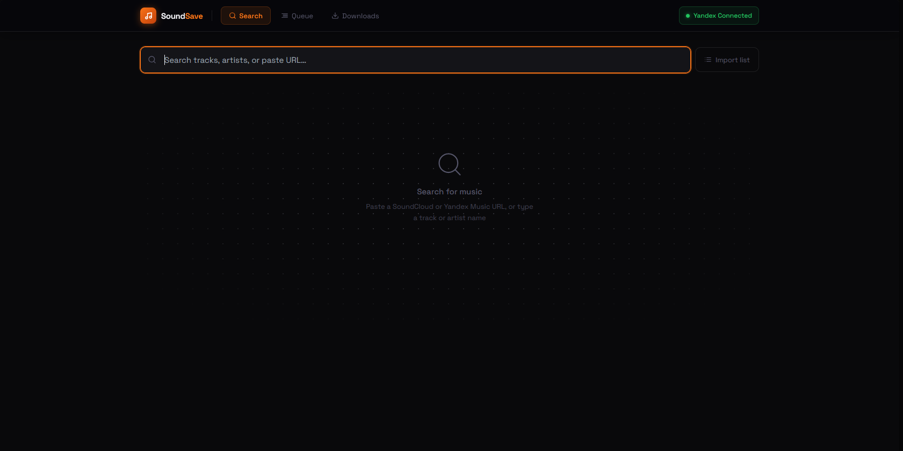
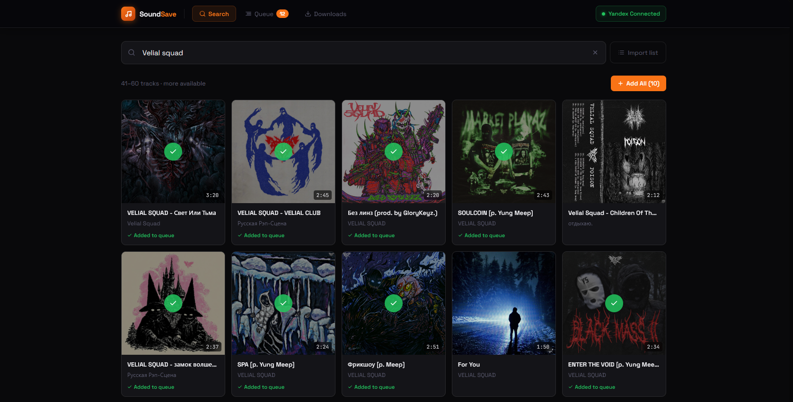
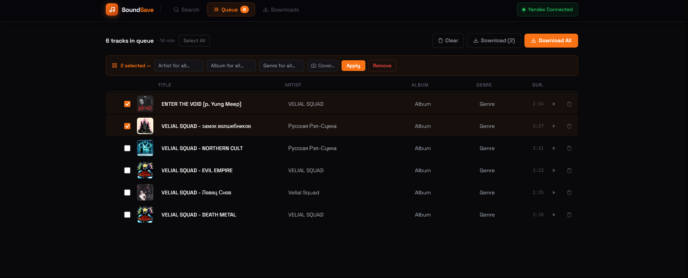
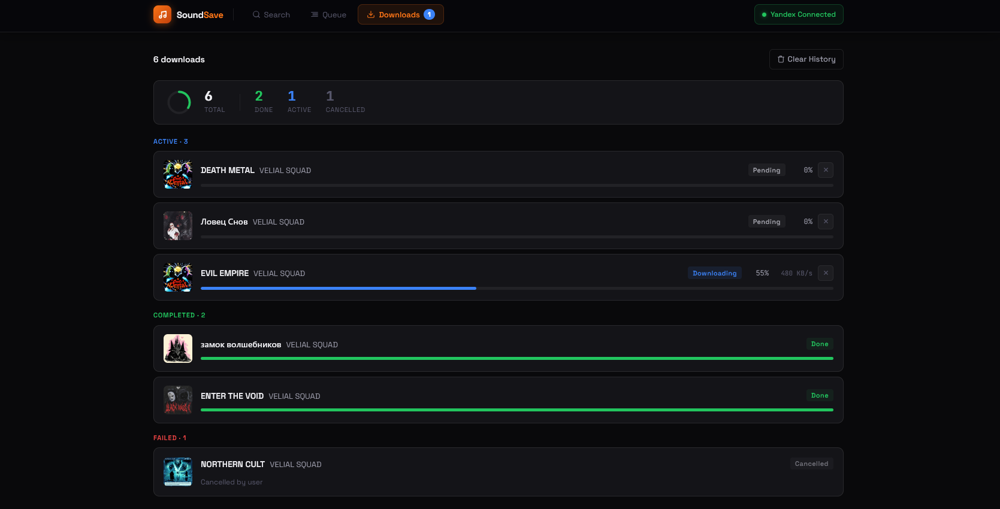

<h1 align="center"> SoundSave </h1>

<p align="center">
  <a href="https://www.python.org/downloads/"></a>
  <a href="https://fastapi.tiangolo.com/"></a>
  <a href="https://react.dev/"></a>
  <a href="LICENSE"></a>
</p>

🌐 [EN](README.md) | [RU](README_RUS.md)

---

> **Russia / СНГ:** SoundCloud и YouTube заблокированы на территории РФ. Для работы приложения требуется VPN.

---

<!-- ABOUT -->
<h1 align="left">ℹ️ About</h1>

- **Source:** SoundCloud, YouTube, any [yt-dlp](https://github.com/yt-dlp/yt-dlp) URL
- **Output:** MP3 320 kbps with embedded ID3 tags
- **Backend:** [**`Python 3.12`**](https://www.python.org/) · [**`FastAPI`**](https://fastapi.tiangolo.com/) · [**`yt-dlp`**](https://github.com/yt-dlp/yt-dlp)
- **Frontend:** [**`React 18`**](https://react.dev/) · [**`Vite 5`**](https://vite.dev/) · [**`Tailwind CSS`**](https://tailwindcss.com/)
- **Database:** [**`SQLite`**](https://www.sqlite.org/) (async via SQLAlchemy)
- **FFmpeg:** auto-bundled via `static-ffmpeg` — no manual install needed

</br>

---

## 🖼️ Gallery






---

## 🚀 Features

- **Search** — text search on SoundCloud or paste any URL (SoundCloud, YouTube, all yt-dlp sources)
- **Queue** — editable metadata before download: title, artist, album, genre, cover art
- **Bulk download** — MP3 320 kbps with embedded ID3 tags (cover art included)
- **Import tracklist** — paste raw text with title+URL pairs, standalone URLs, or plain search queries
- **Yandex Music** — import shared playlists (requires Yandex account authorization)
- **Real-time progress** — per-track status: pending → downloading → converting → tagging → done
- **Cancel** — cancel any download mid-progress
- **Alternatives** — search for a replacement if a track fails to download
- **Preview** — listen to a track preview before adding to the queue
- **Batch report** — summary modal after each download session

---

## 📦 Requirements

- Python 3.12+
- Node.js 18+
- FFmpeg — **no manual install needed**, downloaded automatically

## ⚡ Quick start

```bash
git clone https://github.com/NZT-48-Z/SoundSave.git
cd SoundSave
```

**Backend** (terminal 1):

Using [`uv`](https://docs.astral.sh/uv/) (recommended):

```bash
cd backend
uv venv
uv sync
uv run python main.py
```

Or with `pip`:

```bash
cd backend
python -m venv .venv

# Windows
.venv\Scripts\activate
# macOS / Linux
source .venv/bin/activate

pip install .
python main.py
```

**Frontend** (terminal 2):

```bash
cd frontend
npm install
npm run dev
```

Open [http://localhost:3000](http://localhost:3000).

---

## ⚙️ Configuration

All defaults work out of the box. To override, edit `backend/.env`:

```env
PORT=8000
DOWNLOAD_DIR=~/Music/SoundSave
DB_PATH=./soundsave.db
DEBUG=true
```

---

## 🎧 Yandex Music

To import playlists from Yandex Music, connect your account first. Click the Yandex Music import button in the app and follow the OAuth flow — the token is stored locally via the system keyring.

---

## 📄 License

[MIT](LICENSE)
