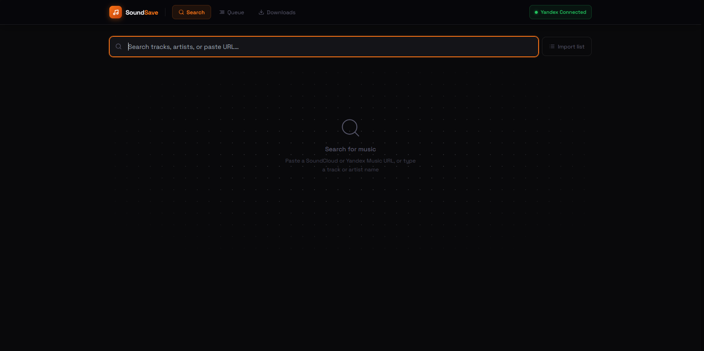
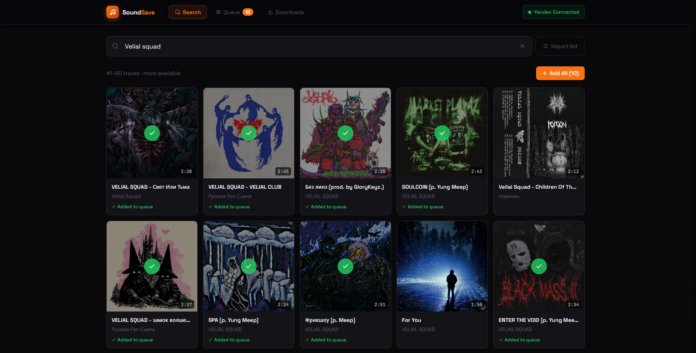
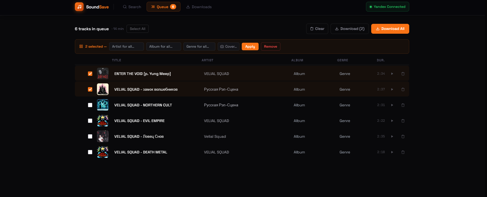
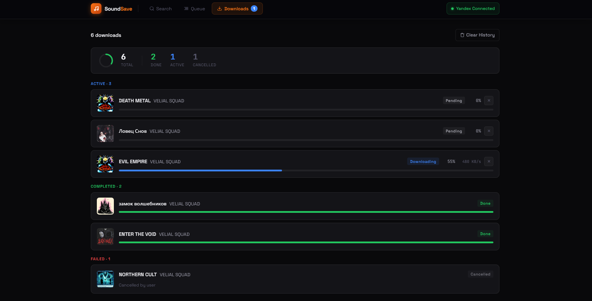

<h1 align="center"> SoundSave </h1>

<p align="center">
  <a href="https://www.python.org/downloads/"></a>
  <a href="https://fastapi.tiangolo.com/"></a>
  <a href="https://react.dev/"></a>
  <a href="https://www.docker.com/"></a>
  <a href="LICENSE"></a>
</p>

🌐 [EN](README.md) | [RU](README_RUS.md)

---

> **Russia / СНГ:** SoundCloud и YouTube могут быть заблокированы на территории РФ. Для работы приложения может понадобиться VPN.

---

<!-- ABOUT -->
<h1 align="left">ℹ️ About</h1>

- **Source:** SoundCloud, YouTube, any [yt-dlp](https://github.com/yt-dlp/yt-dlp) URL
- **Output:** MP3 320 kbps with embedded ID3 tags
- **Backend:** [**`Python 3.12`**](https://www.python.org/) · [**`FastAPI`**](https://fastapi.tiangolo.com/) · [**`yt-dlp`**](https://github.com/yt-dlp/yt-dlp)
- **Frontend:** [**`React 18`**](https://react.dev/) · [**`Vite 5`**](https://vite.dev/) · [**`Tailwind CSS`**](https://tailwindcss.com/)
- **Database:** [**`SQLite`**](https://www.sqlite.org/) (async via SQLAlchemy)
- **FFmpeg:** auto-bundled via `static-ffmpeg` — no manual install needed

</br>

---

## 🖼️ Gallery






---

## 🚀 Features

- **Search** — text search on SoundCloud or paste any URL (SoundCloud, YouTube, all yt-dlp sources)
- **Queue** — editable metadata before download: title, artist, album, genre, cover art
- **Bulk download** — MP3 320 kbps with embedded ID3 tags (cover art included)
- **Import tracklist** — paste raw text with title+URL pairs, standalone URLs, or plain search queries
- **Yandex Music** — import shared playlists (requires Yandex account authorization)
- **Real-time progress** — per-track status: pending → downloading → converting → tagging → done
- **Cancel** — cancel any download mid-progress
- **Alternatives** — search for a replacement if a track fails to download
- **Preview** — listen to a track preview before adding to the queue
- **Batch report** — summary modal after each download session

---

## 📦 Requirements

- [Docker](https://www.docker.com/) & Docker Compose — **recommended**, everything else is handled inside the containers
- *or*, for a manual setup: Python 3.12+, Node.js 18+, FFmpeg (auto-downloaded, no manual install needed)

## ⚡ Quick start

### 🐳 Docker (recommended)

The project ships with a ready-to-use `docker-compose.yml` — two containers (FastAPI backend + nginx-served frontend), FFmpeg preinstalled, no local Python/Node setup required.

```bash
git clone https://github.com/NZT-48-Z/SoundSave.git
cd SoundSave
cp .env.example .env
```

Edit `.env` and fill in the two required values:

```env
SOUNDSAVE_KEYRING_SECRET=   # generate with: openssl rand -hex 32
SOUNDSAVE_MUSIC_DIR=        # absolute host folder for downloaded tracks, e.g. C:/Users/you/Music/SoundSave
```

```bash
docker compose up -d --build
```

Open [http://localhost:3000](http://localhost:3000). Downloaded tracks land directly in `SOUNDSAVE_MUSIC_DIR` on your machine; the database and the encrypted Yandex token live in a Docker-managed volume.

<details>
<summary>Manual setup (without Docker)</summary>

**Backend** (terminal 1):

Using [`uv`](https://docs.astral.sh/uv/) (recommended):

```bash
cd backend
uv venv
uv sync
uv run python main.py
```

Or with `pip`:

```bash
cd backend
python -m venv .venv

# Windows
.venv\Scripts\activate
# macOS / Linux
source .venv/bin/activate

pip install .
python main.py
```

**Frontend** (terminal 2):

```bash
cd frontend
npm install
npm run dev
```

Open [http://localhost:3000](http://localhost:3000).

</details>

---

## ⚙️ Configuration

**Docker** — all settings live in `.env` (see `.env.example`): `SOUNDSAVE_KEYRING_SECRET`, `SOUNDSAVE_MUSIC_DIR`, `FRONTEND_PORT`.

**Manual setup** — all defaults work out of the box. To override, edit `backend/.env`:

```env
PORT=8000
DOWNLOAD_DIR=~/Music/SoundSave
DB_PATH=./soundsave.db
DEBUG=true
```

---

## 🎧 Yandex Music

To import playlists from Yandex Music, connect your account first. Click the Yandex Music import button in the app and follow the OAuth flow. The token is stored locally via the system keyring (manual setup) or via an encrypted file-based keyring inside the container (Docker setup — there's no system keyring to use in Linux containers).

---

## 📄 License

[MIT](LICENSE)
